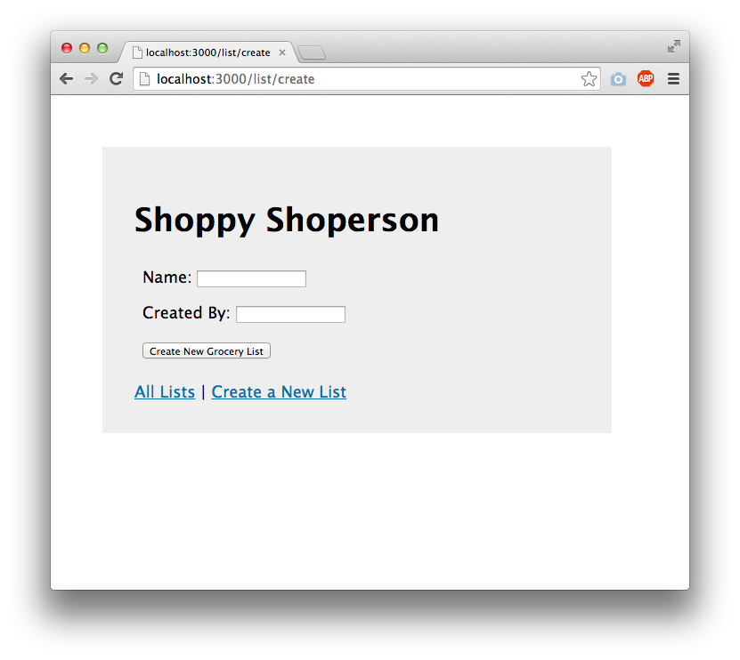

The content below is an example project proposal / requirements document. Replace the text below the lines marked "__TODO__" with details specific to your project. Remove the "TODO" lines.

(__TODO__: your project name)

# Usa-dle

## Overview

(__TODO__: a brief one or two paragraph, high-level description of your project)

Usa-dle is like wordle, but American themed. This means that all the possible answers will somehow be related to the United States. Wordle is a game where you guess a five letter word and have 6 guesses. Every guess gives you hints on each individual letter, like if its in the word but in the wrong place or in the right place or if its not in the word at all. 

## Data Model

(__TODO__: a description of your application's data and their relationships to each other) 

The application will store the tiles that are displayed on the screen (which will transform color depending on the input) and the guesses inputed by the user. 


(__TODO__: sample documents)

An Example Tile:

```javascript
{
Tile:
Properties:
  x: Number (the x-coordinate of the tile)
  y: Number (the y-coordinate of the tile)
  letter: String (the letter displayed on the tile)
  status: String (the status of the tile, can be "normal", "match", or "has")

Methods:
display(): void (renders the tile on the canvas)
}
```

An Example List with Embedded Items:

```javascript
{
  user: // a reference to a User object
  name: "Breakfast foods",
  items: [
    { name: "pancakes", quantity: "9876", checked: false},
    { name: "ramen", quantity: "2", checked: true},
  ],
  createdAt: // timestamp
}
```


## [Link to Commented First Draft Schema](db.mjs) 

(__TODO__: create a first draft of your Schemas in db.mjs and link to it)

## Wireframes

(__TODO__: wireframes for all of the pages on your site; they can be as simple as photos of drawings or you can use a tool like Balsamiq, Omnigraffle, etc.)

/list/create - page for creating a new shopping list



/list - page for showing all shopping lists


/list/slug - page for showing specific shopping list


## Site map

(__TODO__: draw out a site map that shows how pages are related to each other)

<!-- Here's a [complex example from wikipedia](https://upload.wikimedia.org/wikipedia/commons/2/20/Sitemap_google.jpg), but you can create one without the screenshots, drop shadows, etc. ... just names of pages and where they flow to. -->
See sitemap_seah

## User Stories or Use Cases

(__TODO__: write out how your application will be used through [user stories](http://en.wikipedia.org/wiki/User_story#Format) and / or [use cases](https://en.wikipedia.org/wiki/Use_case))

Users will be able to guess
Guesses will be checked 
User will be able to play again, regardless if they win or lose

## Research Topics

(__TODO__: the research topics that you're planning on working on along with their point values... and the total points of research topics listed)

* (6 points) React
  -I will learn how to use React to make this application
    
* (5 points) Headless Chrome
-Learn how to use headless chrome to test my code and make it more efficient. 

10 points total out of 8 required points (___TODO__: addtional points will __not__ count for extra credit)


## [Link to Initial Main Project File](app.mjs) 

(__TODO__: create a skeleton Express application with a package.json, app.mjs, views folder, etc. ... and link to your initial app.mjs)

## Annotations / References Used

(__TODO__: list any tutorials/references/etc. that you've based your code off of)

I will be using the game i already made on p5js. 
https://editor.p5js.org/teatart1/sketches/VWE64Z6zS

